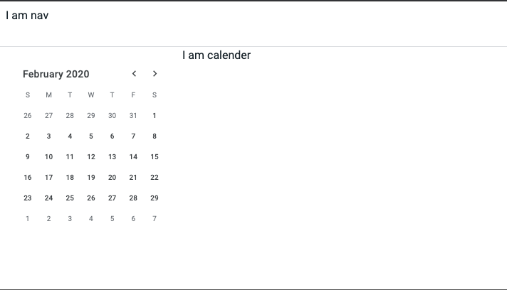

## Google Calendar - Desgin - Functionality [ cloning ]

This project has been move to this repo [svelte google calendar](https://github.com/karthikricssion/svelte-google-calendar)

Will be using this repo for svelte sample tryouts

Tech stacks
- Svelte
- CSS3

For date parsing, using [Date-fns](https://date-fns.org/)

### To do components 
1. Side nav calender
2. Main calender 
    - Day view
    - Week view
    - Month view
    - Year view

### Timeline
- As of 6th May 2020 \
  

Ref Materials
https://tobiasahlin.com/blog/flexbox-break-to-new-row/
https://calendar.google.com/
https://svelte.dev/examples